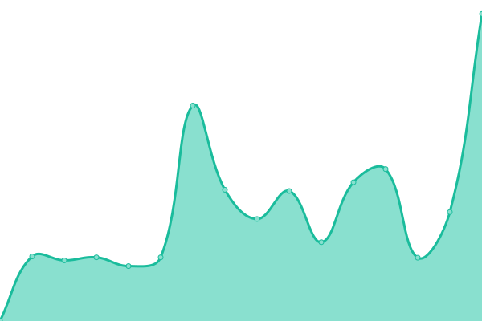
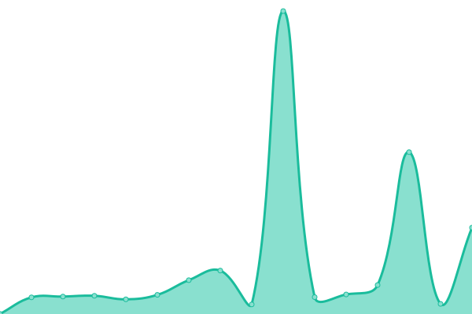
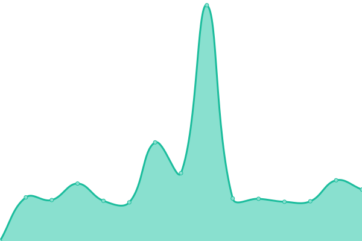

# [📈 Live Status](https://censecar.github.io/censecar): <!--live status--> **🟧 Partial outage**

This repository contains the open-source uptime monitor and status page for [censecar](https://censecar.github.io/censecar), powered by [Upptime](https://github.com/upptime/upptime).

With [Upptime](https://upptime.js.org), you can get your own unlimited and free uptime monitor and status page, powered entirely by a GitHub repository. We use [Issues](https://github.com/censecar/censecar/issues) as incident reports, [Actions](https://github.com/censecar/censecar/actions) as uptime monitors, and [Pages](https://censecar.github.io/censecar) for the status page.

<!--start: status pages-->
<!-- This summary is generated by Upptime (https://github.com/upptime/upptime) -->
<!-- Do not edit this manually, your changes will be overwritten -->
<!-- prettier-ignore -->
| URL | Status | History | Response Time | Uptime |
| --- | ------ | ------- | ------------- | ------ |
|  [SIMA (MANIFIESTOS)](http://200.12.125.74) | 🟩 Up | [sima-manifiestos.yml](https://github.com/censecar/censecar/commits/HEAD/history/sima-manifiestos.yml) | 

 895ms
     
 | 

<a href="https://censecar.github.io/censecar/history/sima-manifiestos">100.00%</a>
    

|  [SAAIT (FIANZAS)](http://200.12.125.73/Login) | 🟥 Down | [saait-fianzas.yml](https://github.com/censecar/censecar/commits/HEAD/history/saait-fianzas.yml) | 

 246ms
     
 | 

<a href="https://censecar.github.io/censecar/history/saait-fianzas">99.98%</a>
    

|  [Manifiestos (NUEVO)](https://manifiestos.censecar.com.mx) | 🟩 Up | [manifiestos-nuevo.yml](https://github.com/censecar/censecar/commits/HEAD/history/manifiestos-nuevo.yml) | 

 453ms
     
 | 

<a href="https://censecar.github.io/censecar/history/manifiestos-nuevo">100.00%</a>
    

|  [Fianzas (NUEVO)](https://fianzas.censecar.com.mx) | 🟩 Up | [fianzas-nuevo.yml](https://github.com/censecar/censecar/commits/HEAD/history/fianzas-nuevo.yml) | 

 380ms
     
 | 

<a href="https://censecar.github.io/censecar/history/fianzas-nuevo">100.00%</a>
    

|  [Contrato Digital (CARTA PORTE)](https://contratodigital.online) | 🟩 Up | [contrato-digital-carta-porte.yml](https://github.com/censecar/censecar/commits/HEAD/history/contrato-digital-carta-porte.yml) | 

 555ms
     
 | 

<a href="https://censecar.github.io/censecar/history/contrato-digital-carta-porte">99.14%</a>
    

<!--end: status pages-->

[**Visit our status website →**](https://censecar.github.io/censecar)

## 📄 License

- Powered by: [Upptime](https://github.com/upptime/upptime)
- Code: [MIT](./LICENSE) © [censecar](https://censecar.github.io/censecar)
- Data in the `./history` directory: [Open Database License](https://opendatacommons.org/licenses/odbl/1-0/)
